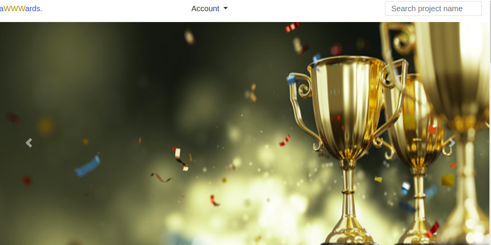

# Awards254

# Authour : ONDIEKI DIANA MONGINA

# DESCRIPTION

The purpose of this  create an application like Awwards. The application will allow a user to post a project he/she has created and get it reviewed by his/her peers.

# Live Link

# Screnshot

  

# User Story

View posted projects and their details
Post a project to be rated/reviewed
Rate/ review other users' projects
Search for projects 
View projects overall score
View my profile page

# Setup and Installation

<b>Clone the repository:</b>

    - git@github.com:monginadiana/Awwaardss254.git

<b>Navigate into the folder and install requirements</b>

    -cd Awwwards 

<b>Install and activate Virtual</b>

    - python3 -m venv virtual 
    - source virtual/bin/activate 

<b>Install Dependencies</b>

    -pip install -r requirements.txt 

<b>Setup Database</b>

SetUp your database User,Password, Host then make migrate

    -python manage.py makemigrations
    -python manage.py migrate 

<b>Run the application</b>

    -python manage.py runserver

<b>Testing the application</b>

    -python manage.py test
    

# Technology Used

Heroku

Django

POstgress

HTML

Css

# Known Bugs

No know Bugs found at the moment

## Support and Contact Information
To make a contribution to the code used or for any queries feel free to contact me via my email addresses dianahmongina2@gmail.com

## License

MIT LICENCE
Copyright (c) 2021 Ezekiel Kibiego ~ Moringa School
Permission is hereby granted, free of charge, to any person obtaining a copy of this software and associated documentation files (the "Software"), to deal in the Software without restriction, including without limitation the rights to use, copy, modify, merge, publish, distribute, sublicense, and/or sell copies of the Software, and to permit persons to whom the Software is furnished to do so, subject to the following conditions:

The above copyright notice and this permission notice shall be included in all copies or substantial portions of the Software.

THE SOFTWARE IS PROVIDED "AS IS", WITHOUT WARRANTY OF ANY KIND, EXPRESS OR IMPLIED, INCLUDING BUT NOT LIMITED TO THE WARRANTIES OF MERCHANTABILITY, FITNESS FOR A PARTICULAR PURPOSE AND NONINFRINGEMENT. IN NO EVENT SHALL THE AUTHORS OR COPYRIGHT HOLDERS BE LIABLE FOR ANY CLAIM, DAMAGES OR OTHER LIABILITY, WHETHER IN AN ACTION OF CONTRACT, TORT OR OTHERWISE, ARISING FROM, OUT OF OR IN CONNECTION WITH THE SOFTWARE OR THE USE OR OTHER DEALINGS IN THE SOFTWARE.
